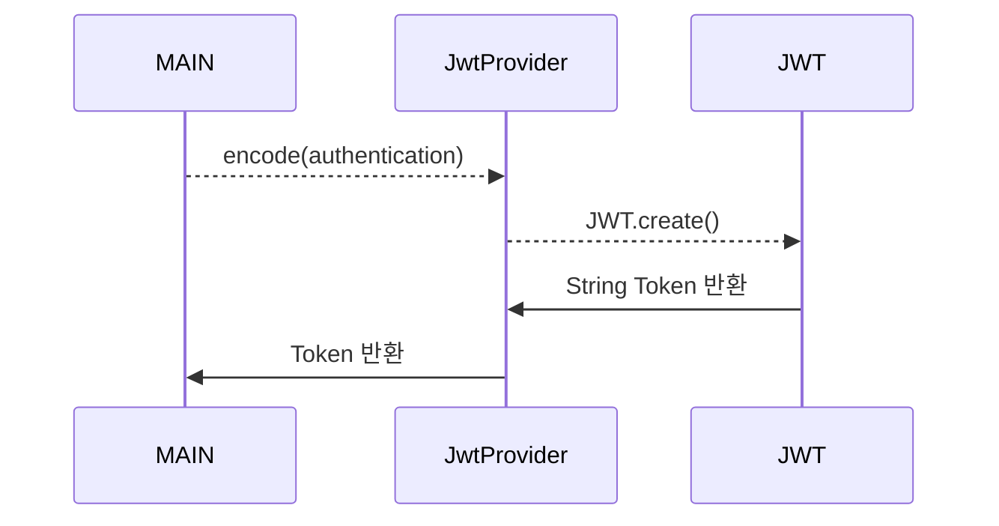
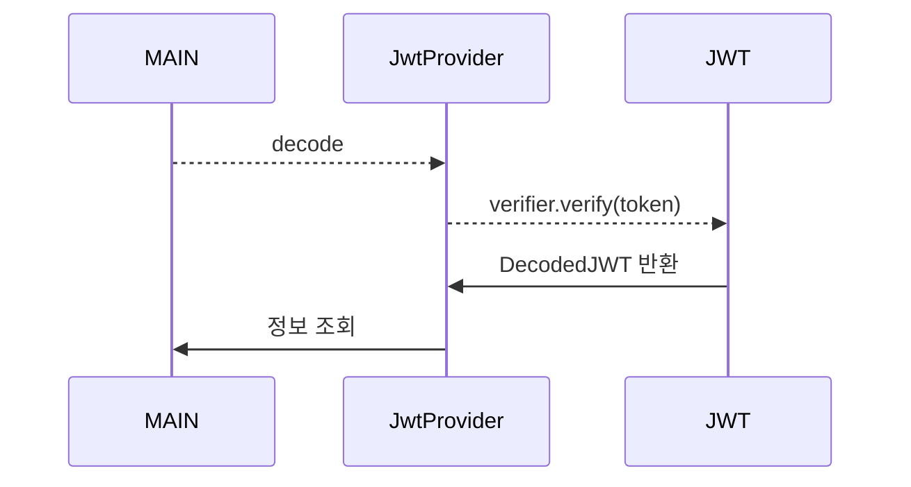

# jwt-io-api-project
 JWT.io API 테스트

### 시퀀스 다이어그램

### Encode



### Decode



### Main

```java
public class Main {
    private final static JwtProvider jwtProvider = new JwtProvider();

    public static void main(String[] args) {
        Authentication authentication = new FakeAuthentication();
        String token = jwtProvider.encode(authentication);

        if (jwtProvider.verify(token)) {
            Map<String, Claim> decode = jwtProvider.decode(token);
            for (Map.Entry<String, Claim> stringClaimEntry : decode.entrySet()) {
                System.out.println(stringClaimEntry.getKey() + " : " + stringClaimEntry.getValue());
            }
        }
    }
}
```

### JwtProvider

```java
public class JwtProvider {
    private static final String ISSUER = "auth0";
    private static final String SECRET_KEY = "secret";
    private static final Algorithm algorithm = Algorithm.HMAC256(SECRET_KEY);
    private static final JWTVerifier verifier = JWT.require(algorithm).withIssuer(ISSUER).build();
    private static final String AUTHORITIES_KEY = "Auth";

    public String encode(Authentication authentication) {
        String authorities = authentication.getAuthorities().stream()
            .map(GrantedAuthority::getAuthority)
            .collect(Collectors.joining(","));

        System.out.println(authorities);

        try {
            String token = JWT.create()
                .withSubject((String) authentication.getPrincipal())
                .withClaim(AUTHORITIES_KEY, authorities)
                .withIssuer(ISSUER)
                .sign(algorithm);
            System.out.println(token);
            return token;
        } catch (JWTCreationException exception) {
            return "";
        }
    }

    public Map<String, Claim> decode(String token) {
        DecodedJWT jwt = verifier.verify(token);
        Map<String, Claim> claims = jwt.getClaims();
        return claims;
    }

    public boolean verify(String token) {
        try {
            verifier.verify(token);
            return true;
        } catch (JWTVerificationException exception) {
            return false;
        }
    }
}
```

### Encode

JWT.create()를 호출해 JWT 인스턴스를 생성한다. 그리고 빌더를 사용해 필요로 하는 내용들을 저장한다. **필수적으로 Algorithm 구현체를 `sign()` 함수에 담아 인스턴스를 전달해야 한다.**

<aside>
💡 클레임을 JSON으로 변환할 수 없거나 서명 프로세스에 사용된 키가 유효하지 않은 경우 `JWTCreationException`이 발생한다.
</aside>

### Verify

토큰을 확인할 때, 값이 유효하지 않을 때 `JWTVerificationException`이 발생한다.

### Authentication

```java
public interface Authentication extends Principal, Serializable {
    Collection<? extends GrantedAuthority> getAuthorities();

    Object getCredentials();

    Object getDetails();

    Object getPrincipal();

    boolean isAuthenticated();

    void setAuthenticated(boolean isAuthenticated) throws IllegalArgumentException;
}
```

### GrantedAuthority

```java
public interface GrantedAuthority extends Serializable {
    String getAuthority();
}
```

### FakeAuthentication

```java
public class FakeAuthentication implements Authentication{
    @Override
    public Collection<? extends GrantedAuthority> getAuthorities() {
        return List.of((GrantedAuthority) () -> "Role_User");
    }

    @Override
    public Object getCredentials() {
        return "password";
    }

    @Override
    public Object getDetails() {
        return "details";
    }

    @Override
    public Object getPrincipal() {
        return "principal";
    }

    @Override
    public boolean isAuthenticated() {
        return false;
    }

    @Override
    public void setAuthenticated(boolean isAuthenticated) throws IllegalArgumentException {

    }

    @Override
    public String getName() {
        return "name";
    }
}
```
